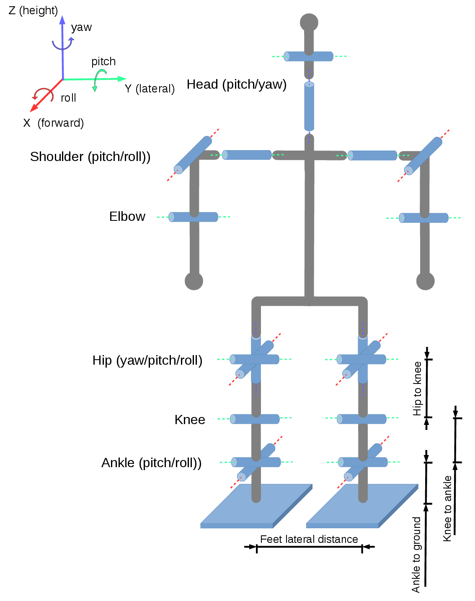

# Leg Inverse Kinematics

To directly use the leg inverse kinematics, first include the header file.
```cpp
#include <HumanoidModel.hpp>
```

The model object have to be initialized with geometric
parameters of the robot.
```cpp
//Init Humanoid Model
Leph::HumanoidModel model(
    distHipToKnee, 
    distKneeToAnkle, 
    distAnkleToGround, 
    distFeetLateral);
```

Target Cartesian foot position is given with respect to the foot tip center
at initial position shown in model schema. The target foot orientation is given
using desired Euler angles representation.
The inverse kinematics returns false if the target position is not reachable.
```cpp
Rhoban::IKWalkOutputs outputs;
Eigen::Vector3d posLeft(leftX, leftY, leftZ);
Eigen::Vector3d angleLeft(leftPitch, leftRoll, leftYaw);
//Run inverse invert kinematics on both legs
//using Pitch-Roll-Yaw convention
bool successLeft = model.legIkLeft(
    posLeft, angleLeft, Leph::EulerPitchRollYaw, outputs);
```
Likewise,  use the method ``legIKRight`` to update right leg degrees of freedom.
All Euler angles types are available:
```cpp
EulerYawPitchRoll
EulerYawRollPitch
EulerRollPitchYaw
EulerRollYawPitch
EulerPitchRollYaw
EulerPitchYawRoll
```
EulerYawRollPitch means first Yaw (Z) rotation is applied, then Pitch (Y) and finally Roll (X).

Computed target positions (in radians) are then available inside the structure for left or right legs:
```cpp
outputs.left_hip_yaw
outputs.left_hip_pitch
outputs.left_hip_roll
outputs.left_knee
outputs.left_ankle_pitch
outputs.left_ankle_roll
outputs.right_hip_yaw
outputs.right_hip_pitch
outputs.right_hip_roll
outputs.right_knee
outputs.right_ankle_pitch
outputs.right_ankle_roll
```

Needed geometric parameters are depicted bellow:


